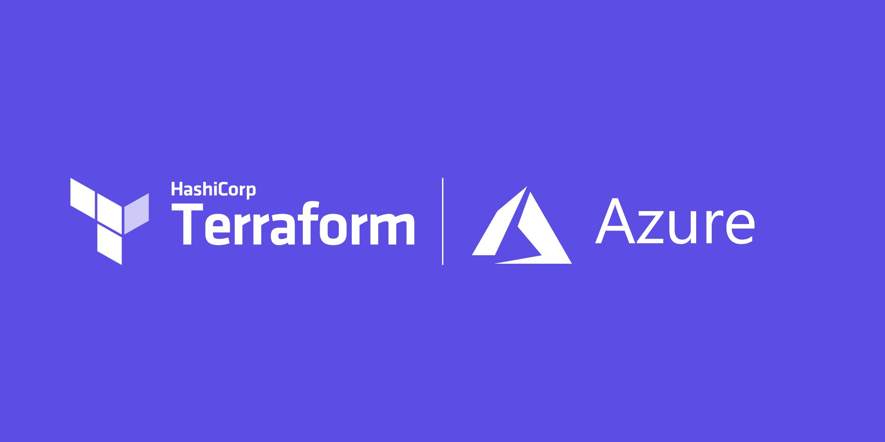

Udemy Course >> Terraform Infrastructure as Code (IaC) Azure Virtual Machine

Infrastructure Server Deployment Azure Cloud Management with Terraform Infrastructure as Code (IaC) Azure DevOps Compute + Azure Lab

**********

Tips/Tricks/Notes/Commands URL Link: 
https://github.com/nimaxnimax/Udemy_Terraform_IaC/tree/main/azure_virtual_machine

Instructor & Courses >> 
https://www.udemy.com/user/adrian-fischer-infotech/

**********

Introduction of Terraform in Azure
Everything you need to deploy resources in Azure with Terraform!

When learning Terraform for Infrastructure as Code (IaC) with a focus on Azure Virtual Machines, students should cover a range of topics to gain a comprehensive understanding. Here's a list of key concepts and skills that students should learn in a Terraform Azure Virtual Machine course:

1. **Terraform Basics:**
   - Understand the fundamentals of Terraform, including its syntax, configuration files (`.tf`), and provider-based approach.

2. **Azure Provider:**
   - Learn how to configure the Azure provider in Terraform.
   - Understand the different configuration settings available for the Azure provider.

3. **Resource Blocks:**
   - Create Azure Virtual Machines using `azurerm_linux_virtual_machine` or `azurerm_windows_virtual_machine` resource blocks.
   - Specify essential parameters such as `name`, `resource_group_name`, and `location`.

4. **Virtual Machine Configuration:**
   - Configure VM-specific settings, including `size`, `admin_username`, `admin_password` or `admin_ssh_key`, and `os_disk`.

5. **Networking:**
   - Set up networking components such as virtual networks (`azurerm_virtual_network`), subnets (`azurerm_subnet`), and network interfaces (`azurerm_network_interface`).
   - Understand how to associate these components with the virtual machine.

6. **Image References:**
   - Work with different sources for virtual machine images, such as Azure Marketplace images or custom images.

7. **Boot Diagnostics:**
   - Enable boot diagnostics to capture console screenshots or logs during the VM provisioning process.

8. **Data Disks:**
   - Attach additional data disks to the virtual machine (`data_disk` block).

9. **Variables and Input Parameters:**
   - Learn how to use variables and input parameters to make configurations more dynamic and reusable.

10. **Output Values:**
    - Define output values to retrieve information from the Terraform state, such as the public IP address of the virtual machine.

11. **Modules:**
    - Understand the use of Terraform modules for modularizing and reusing configurations.

12. **Conditional Deployment:**
    - Implement conditional deployments based on specific criteria or variables.

13. **Provisioners:**
    - Use provisioners to execute scripts or commands on the virtual machine after creation (e.g., `remote-exec`).

14. **Terraform State Management:**
    - Learn about Terraform state, including backends and how to manage state files.

15. **Best Practices:**
    - Understand best practices for writing Terraform code, organizing files, and structuring configurations.

16. **Error Handling and Troubleshooting:**
    - Gain proficiency in troubleshooting common errors and debugging Terraform configurations.

17. **Security Considerations:**
    - Address security considerations related to virtual machines, such as authentication methods and network security groups.

18. **Scaling and Auto-Scaling:**
    - Explore concepts related to scaling virtual machine instances, both manual and auto-scaling configurations.

19. **Version Control Integration:**
    - Learn how to integrate Terraform configurations with version control systems like Git.

20. **Continuous Integration/Continuous Deployment (CI/CD):**
    - Explore CI/CD pipelines for automating the deployment and testing of Terraform configurations.

Remember that hands-on practice and real-world projects are crucial for reinforcing these concepts. Students should have the opportunity to apply their knowledge through labs, exercises, and projects to gain practical experience with Terraform and Azure Virtual Machines.

Learning Terraform for Infrastructure as Code (IaC) with a focus on Azure Virtual Machines is beneficial for various professionals involved in cloud infrastructure management, development, and operations. Here's a list of individuals who can benefit from learning Terraform and Azure Virtual Machines:

1. **Cloud Engineers and Architects:**
   - Cloud engineers and architects who design and implement cloud infrastructure will find Terraform valuable for creating, managing, and versioning infrastructure as code.

2. **DevOps Engineers:**
   - DevOps engineers can use Terraform to automate the provisioning and configuration of Azure Virtual Machines, promoting consistency and repeatability in deployment pipelines.

3. **System Administrators:**
   - System administrators can leverage Terraform to automate the deployment and management of virtual machines, reducing manual intervention and ensuring standardized configurations.

4. **Infrastructure Engineers:**
   - Infrastructure engineers responsible for maintaining and scaling cloud-based infrastructure can use Terraform to define and manage the desired state of their environments.

5. **Operations Teams:**
   - Operations teams benefit from using Terraform to define infrastructure configurations, making it easier to reproduce environments and deploy updates consistently.

6. **Application Developers:**
   - Application developers can use Terraform to define and provision the infrastructure required for their applications, ensuring a streamlined and automated deployment process.

7. **IT Managers and Team Leads:**
   - IT managers and team leads can benefit from understanding Terraform to make informed decisions about infrastructure provisioning, deployment processes, and resource management.

8. **Security Professionals:**
   - Security professionals can gain insights into how infrastructure is provisioned and configured, allowing them to review and enhance security practices within the IaC workflows.

9. **Technical Project Managers:**
   - Technical project managers can benefit from understanding Terraform to make informed decisions about infrastructure planning, resource allocation, and project timelines.

10. **Students and Aspiring Cloud Professionals:**
    - Students pursuing a career in cloud computing or professionals transitioning to cloud roles can learn Terraform to enhance their skills and stay competitive in the job market.

11. **Anyone Involved in Cloud Operations:**
    - Individuals involved in day-to-day cloud operations, whether from a development, operations, or infrastructure perspective, can benefit from the automation capabilities provided by Terraform.

Learning Terraform and Azure Virtual Machines empowers professionals to manage infrastructure efficiently, automate repetitive tasks, and foster collaboration between development and operations teams. As the cloud computing landscape evolves, proficiency in IaC tools like Terraform becomes increasingly valuable.

A list with various interesting links

Azure CLI

https://learn.microsoft.com/en-us/cli/azure/install-azure-cli

Terraform Installation

https://developer.hashicorp.com/terraform/downloads

Terraform and Azure Resources

https://registry.terraform.io/browse/providers

https://registry.terraform.io/providers/hashicorp/azurerm/latest/docs/resources/resource_group

https://developer.hashicorp.com/terraform/language/values/variables

https://developer.hashicorp.com/terraform/language/values/locals

https://registry.terraform.io/providers/hashicorp/azurerm/latest/docs/resources/virtual_network

https://registry.terraform.io/providers/hashicorp/azurerm/latest/docs/resources/subnet

https://registry.terraform.io/providers/hashicorp/azurerm/latest/docs/resources/network_security_group

https://registry.terraform.io/providers/hashicorp/azurerm/latest/docs/resources/network_security_rule

https://registry.terraform.io/providers/hashicorp/azurerm/latest/docs/resources/subnet_network_security_group_association

https://registry.terraform.io/providers/hashicorp/azurerm/latest/docs/resources/public_ip

https://registry.terraform.io/providers/hashicorp/azurerm/latest/docs/resources/network_interface

https://registry.terraform.io/providers/hashicorp/azurerm/latest/docs/resources/windows_virtual_machine

https://developer.hashicorp.com/terraform/cli/commands/destroy

